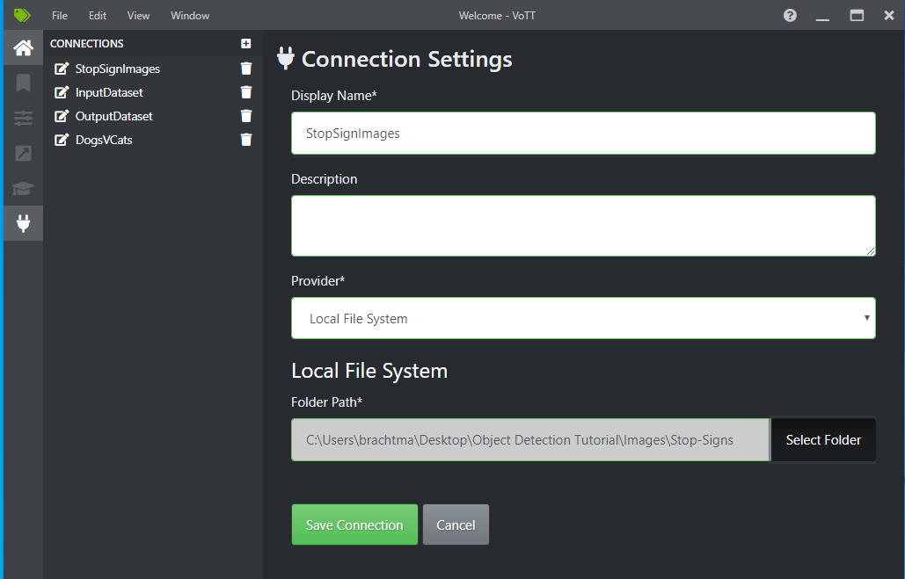
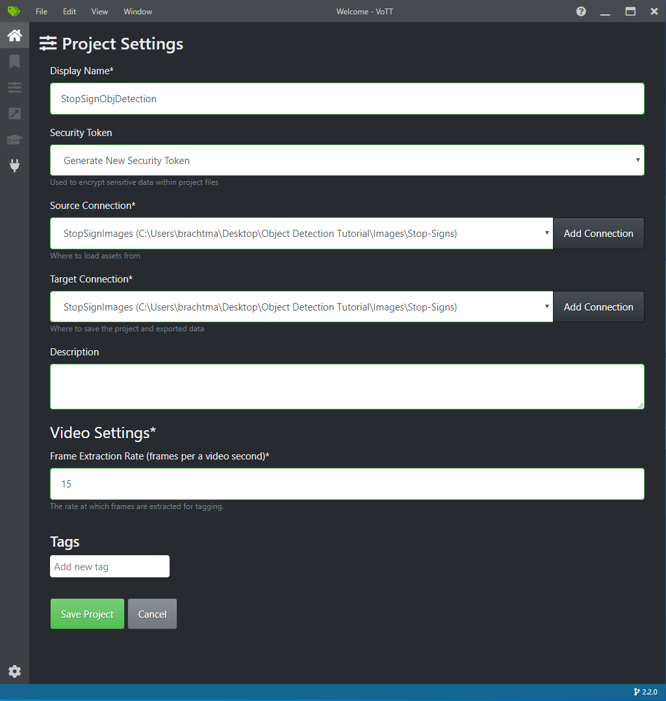
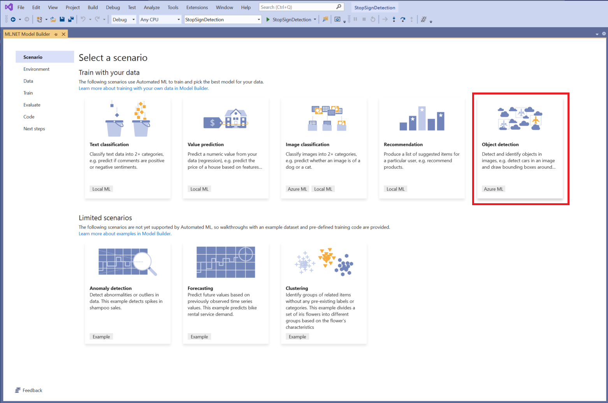
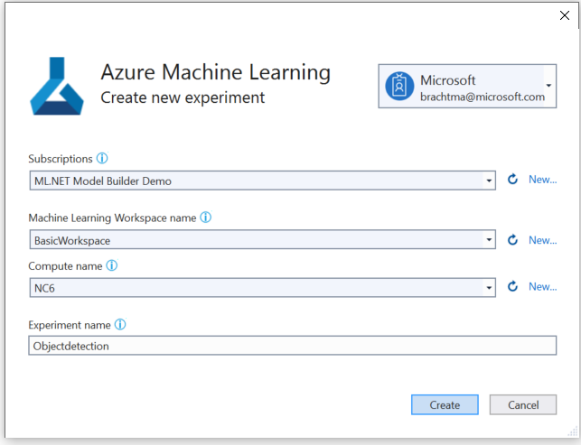
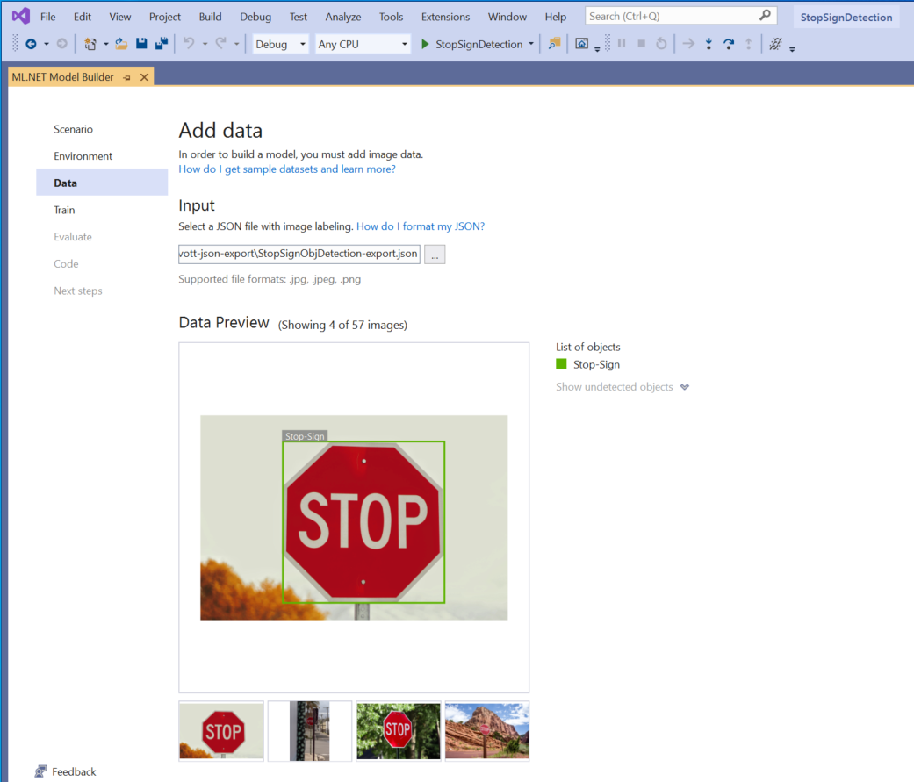

# Tutorial: Detect stop signs in images with Model Builder

Learn how to build an object detection model using Model Builder and Azure ML to detect and locate stop signs in images.

In this tutorial, you learn how to:

> [!div class="checklist"]
>
> - Prepare and understand the data
> - Choose a scenario
> - Choose the training environment
> - Load the data
> - Train the model
> - Evaluate the model
> - Use the model for predictions

> [!NOTE]
> Model Builder is currently in Preview.

## Prerequisites

For a list of prerequisites and installation instructions, visit the [Model Builder installation guide](../how-to-guides/install-model-builder.md).

## Model Builder object detection overview

Object detection is a computer vision problem. While closely related to image classification, object detection performs image classification at a more granular scale. Object detection both locates _and_ categorizes entities within images. Use object detection when images contain multiple objects of different types.


Some use cases for object detection include:

- Self-Driving Cars
- Robotics
- Face Detection
- Workplace Safety
- Object Counting
- Activity Recognition

This sample creates a C# .NET Core console application that detects stop signs in images using a machine learning model built with Model Builder. You can find the source code for this tutorial at the [dotnet/machinelearning-samples](https://sourcecodehere.com) GitHub repository.

## Prepare and understand the data

> The images used to train and evaluate the machine learning model are originally from [Unsplash](https://unsplash.com/).

The Stop Sign dataset consists of 50 images, each of which contain at least one stop sign.

The first thing you need to do is annotate your images, or draw bounding boxes around the stop signs in each image.

In this tutorial, you will annotate your images with a tool called [VoTT](https://github.com/microsoft/VoTT).

> If you want to skip the data labeling step, you can use the [X.json](https://linkhere.com) provided in the repo.

### Create a new VoTT project

1. [Download the dataset](https://datasetlinkhere) of 50 stop sign images and unzip.
1. [Download VoTT](https://github.com/Microsoft/VoTT/releases) (Visual Object Tagging Tool).
1. Open VoTT and select **New Project**.

1. Update the following Project Settings:
    1. Create a *Display Name* (like "StopSignObjDetection").
    1. Select "Generate New Security Token" for *Security Token*.
    1. Create a new Connection for the Source Connection by selecting **Add Connection**. Create a *Display Name* for the connection (like StopSignImages), and select "Local File System" as the Provider. For the *Folder Path*, select the folder which contains the 50 training images.
    
    1. Select the new **Source Connection** that you created in the previous step.
    1. Select the same connection you just created for the **Target Connection**.
    1. Select **Save Project**.


### Add tag and label images

You should now see a window with preview images of all the training images on the left, a preview of the selected image in the middle, and a *Tags* column on the right. This screen is the **Tags editor**.

1. Select the first (plus-shaped) icon in the *Tags* toolbar to add a new tag.

1. Name the tag "Stop-Sign" and hit **Enter** on your keyboard.

1. Click and drag to draw a rectangle around each stop sign in the image. If the cursor does not let you draw a rectangle, try selecting the **Draw Rectangle** tool from the toolbar on the top, or use the keyboard shortcut **R**.
1. After drawing your rectangle, select the **Stop-Sign** tag that you created in the previous steps to add the tag to the bounding box.
1. Click on the preview image for the next image in the dataset and repeat this process.
1. Continue steps 2-3 for every stop sign in every image.


### Export your VoTT JSON

Once you have labeled all of your training images, you can export the file that will be used by Model Builder for training.

1. Select the fourth icon in the left toolbar (the one with the arrow in a box) to go to the *Export Settings*.
1. Leave the *Provider* as "VoTT JSON".
1. Change the *Asset State* to "Only tagged Assets".
1. Uncheck *Include Images*. If you include the images, then the training images will be copied to the export folder that is generated which is not necessary.
1. Select **Save Export Settings**.

1. Go back to the **Tags editor** (the second icon in the left toolbar shaped like a ribbon). In the top toolbar, select the **Export Project** icon (the last icon shaped like an arrow in a box) or use the keyboard shortcut **Ctrl+E**.

This export will create a new folder called "vott-json-export" and will generate a JSON file named "StopSignObjDetection-export" in that new folder. This JSON file will be the dataset input for Model Builder object detection training.

## Create a console application

1. In Visual Studio, create a **C# .NET Core console application** called "StopSignDetection".

## Choose a scenario

1. In **Solution Explorer**, right-click the *StopSignDetection* project, and select **Add** > **Machine Learning**. This opens the Model Builder UI.
1. For this sample, the scenario is object detection. In the *Scenario* step of Model Builder, select the **Object Detection** scenario.


    > If you don't see *Object Detection* in the list of scenarios, you may need to [update your version of Model Builder](https://linkhere.com).

## Choose the training environment
Currently, Model Builder supports training object detection models with Azure only, so the Azure training environment is selected by default.


To train a model using Azure ML, you must create an Azure ML experiment from Model Builder.

An **Azure ML experiment** is a resource that encapsulates the configuration and results for one or more machine learning training runs.

To create an Azure ML experiment, you first need to configure your environment in Azure. An experiment needs the following to run:

- An Azure subscription
- A **workspace**: an Azure ML resource that provides a central place for all Azure ML resources and artifacts created as part of a training run.
- A **compute**: an Azure Machine Learning compute is a cloud-based Linux VM used for training. Learn more about [compute types supported by Model Builder](https://docs.microsoft.com/dotnet/machine-learning/resources/azure-training-concepts-model-builder#what-is-an-azure-machine-learning-compute).

### Set up an Azure ML workspace
To configure your environment:

1. Select the **Set up workspace** button.
1. In the *Create new experiment* dialog, select your Azure subscription.
1. Select an existing or create a new Azure ML workspace.

    When you create a new workspace, the following resources are provisioned:

    - Azure Machine Learning Enterprise workspace
    - Azure Storage
    - Azure Application Insights
    - Azure Container Registry
    - Azure Key Vault

    As a result, this process may take a few minutes.

1. Choose or create a new Azure ML compute. This process may take a few minutes.
1. Leave the default experiment name and select **Create**.


The first experiment is created and its name is registered in the workspace. Any subsequent runs – if the same experiment name is used – are logged as part of the same experiment. Otherwise, a new experiment is created.

If you’re satisfied with your configuration, select the **Next step** button to move to the Data step.

## Load the data

In the Data step of Model Builder, you will select your training dataset.

Model Builder currently only accepts the format of JSON generated by VoTT, but the team plans to add support for more formats in the future. If there is a dataset format for object detection that you’d like to see supported in Model Builder, leave your feedback on [GitHub](https://github.com/dotnet/machinelearning-modelbuilder/issues/new?assignees=&labels=&template=data_suggestion.md&title=).

1. Select the button next to the *Select a folder* text box and use the File Explorer to find the "StopSignObjDetection-export.json" you exported from VoTT in previous steps.

1. If your data looks correct in the Data Preview, select **Next step** to move on to the Train step.

## Train the model

The next step is to train your model.

1. In the Model Builder train screen, select the **Start training** button.

    At this point, your data is uploaded to Azure Storage and the training process begins.

The training process takes some time and the amount of time may vary depending on the size of compute selected as well as the amount of data.

For this sample of 50 images, training took about 16 minutes.

The first time a model is trained in Azure, you can expect a slightly longer training time because resources have to be provisioned. You can track the progress of your runs in the Azure Machine Learning portal by selecting the **Monitor current run in Azure portal** link in Visual Studio.

Once training is complete, select the **Next step** button to move to the Evaluate step.

## Evaluate the model

In the Evaluate screen, you get an overview of the results from the training process, including the model accuracy.


In this case, the accuracy says 100%, which means that the model is more than likely *overfit* due to too few images in the dataset.

You can use the *Try your model* experience to quickly check whether your model is performing as expected.

Select **Browse an image** and provide a test image, preferably one that the model did not use as part of training.


The score shown on each detected bounding box indicates the confidence of the detected object. For instance, in the screenshot above, the score on the bounding box around the stop indicates that the model is 99% sure that the detected object is a stop sign.

The score threshold, which can be increased or decreased with the threshold slider, will add and remove detected objects based on their scores. For instance, if the threshold is .51, then the model will only show objects that have a score / confidence of .51 or above. As you increase the threshold, you will see less detected objects, and as you decrease the threshold, you will see more detected objects.

If you're not satisfied with your accuracy metrics, one easy way to try to improve model accuracy is to use more data. Otherwise, select the **Next step** link to move to the Code step in Model Builder.

## Add the code to make predictions

Two projects are created as a result of the training process.

- StopSignDetectionML.ConsoleApp: A C# .NET Core Console application that contains the model training code and sample consumption code.
- StopSignDetectionML.Model: A .NET Standard class library containing the data models that define the schema of input and output model data, the saved version of the best performing model during training, and a helper class called `ConsumeModel` to make predictions.

1. In the code step of Model Builder, select **Add Projects** to add the autogenerated projects to the solution.
1. Open the *Program.cs* file in the *StopSignDetection* project.
1. Add the following using statement to reference the *StopSignDetectionML.Model* project:

    [!code-csharp [ProgramUsings](~/machinelearning-samples/samples/modelbuilder/MulticlassClassification_RestaurantViolations/RestaurantViolations/Program.cs#L2)]

1. To make a prediction on new images using the model, create a new instance of the `ModelInput` class with the `Input` property set to the url of your test image inside the `Main` method of your application.

    [!code-csharp [TestData](~/machinelearning-samples/samples/modelbuilder/MulticlassClassification_RestaurantViolations/RestaurantViolations/Program.cs#L11-L15)]

1. Use the `Predict` method from the `ConsumeModel` class. The `Predict` method loads the trained model, creates a [`PredictionEngine`](xref:Microsoft.ML.PredictionEngine%602) for the model, and uses it to make predictions on new data.

    [!code-csharp [Prediction](~/machinelearning-samples/samples/modelbuilder/MulticlassClassification_RestaurantViolations/RestaurantViolations/Program.cs#L17-L24)]

1. Run the application.

    The output generated by the program should look similar to the snippet below:

    ```bash
    Inspection Type: Complaint
    Violation Description: Inadequate sewage or wastewater disposal
    Risk Category: Moderate Risk
    ```

If you need to reference the generated projects at a later time inside of another solution, you can find them inside the `C:\Users\%USERNAME%\AppData\Local\Temp\MLVSTools` directory.

Congratulations! You've successfully built a machine learning model to detect stop signs in images using Model Builder. You can find the source code for this tutorial at the [dotnet/machinelearning-samples](https://github.com/dotnet/machinelearning-samples/tree/master/samples/modelbuilder/MulticlassClassification_RestaurantViolations) GitHub repository.

## Additional resources

To learn more about topics mentioned in this tutorial, visit the following resources:

- [Model Builder Scenarios](../automate-training-with-model-builder.md#scenario)
- [Multiclass Classification](../resources/glossary.md#multiclass-classification)
- [Multiclass Classification Model Metrics](../resources/metrics.md#evaluation-metrics-for-multi-class-classification)
